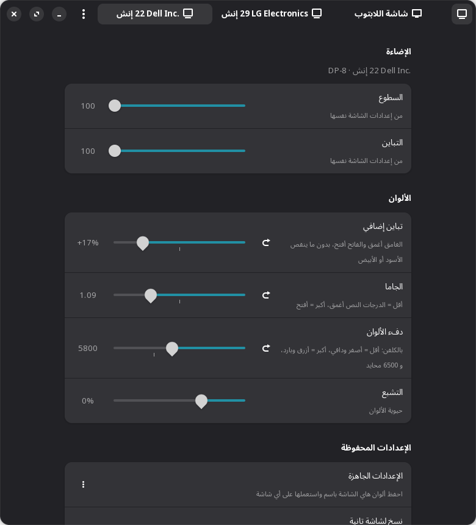
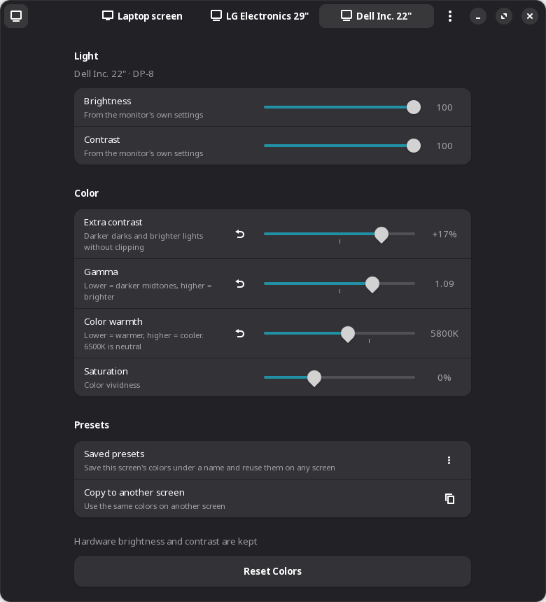
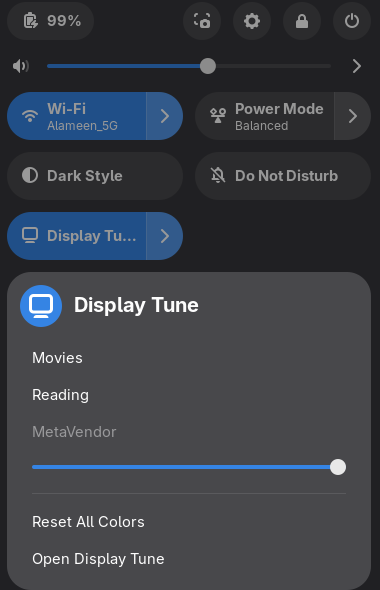

<div dir="rtl">

<p align="center">
  
</p>

<h1 align="center">ضبط الشاشات (Display Tune)</h1>

<p align="center">
  السطوع والتباين والجاما ودفء الألوان والتشبع <b>لكل شاشة على حدة</b> في GNOME على Wayland،<br>
  بواجهة GTK 4 / libadwaita أصلية بالعربية والإنجليزية والروسية والألمانية.
</p>

<p align="center"><a href="README.md">English</a></p>

<p align="center">
  
  
</p>
<p align="center">
  
</p>

## لماذا؟

لا يوفّر GNOME طريقة لجعل شاشة لابتوب باهتة أكثر حيوية، ولا لتعتيم شاشة خارجية، ولا لإعطاء كل شاشة تباينها الخاص. كما أن Wayland يمنع أدوات X11 القديمة، والبدائل الموجودة يغطي كلٌّ منها جزءًا واحدًا فقط. يجمع «ضبط الشاشات» كل ذلك في مكان واحد، لكل شاشة، ويعيد إعداداتك تلقائيًا.

## الميزات

- **صفحة لكل شاشة:** شاشة اللابتوب وكل شاشة خارجية.
- **السطوع:**
  - إضاءة اللابتوب الحقيقية، متزامنة مع شريط GNOME.
  - الشاشات الخارجية عبر DDC/CI، وهو السطوع الحقيقي من الشاشة نفسها.
  - تعتيم برمجي للشاشات التي لا تقبل التحكم.
- **التباين الحقيقي** للشاشات التي تدعم DDC/CI.
- **التباين والجاما ودفء الألوان:** تُطبَّق عبر جدول الألوان في كرت الشاشة، فلا رجفة ولا حمل على المعالج الرسومي، وتعمل في الألعاب والفيديو بملء الشاشة.
- **التشبع لكل شاشة:** عبر إضافة GNOME Shell مرفقة تعمل مع عدة شاشات دون رجفة.
- **إعدادات محفوظة** (مثل «أفلام» و«قراءة») تُطبَّق على أي شاشة.
- **نسخ الإعدادات** من شاشة إلى أخرى أو إلى كل الشاشات.
- **تصدير واستيراد** كل الإعدادات إلى ملف JSON.
- **استعادة تلقائية** عند تسجيل الدخول وعند توصيل أي شاشة.
- **مقارنة بضغطة واحدة:** زر بالشريط العلوي يرجّع كل الشاشات لألوانها الأصلية مؤقتًا، عشان تحكم إذا التعديل فعلاً أحسن.
- **تكامل مع القائمة السريعة:** مفتاح جنب الواي فاي والبلوتوث يشغّل ويطفي تعديلات الألوان، ويطبّق إعداد جاهز، ويضبط سطوع أي شاشة — بدون ما تفتح البرنامج.
- **صفحة اختبار ألوان** لضبط الأسود والأبيض والجاما وتوازن الألوان.
- **أوامر سطر الأوامر** للسكربتات واختصارات لوحة المفاتيح.
- **واجهة عربية (من اليمين لليسار) وإنجليزية وروسية وألمانية:** تتبع لغة النظام (وترجع للإنجليزي إذا لغته مش مدعومة)، ويمكن تغييرها من القائمة.

## المتطلبات

- GNOME على **Wayland** (طُوِّر واختُبر على GNOME 50 مع Fedora 44).
- Python 3 مع PyGObject، وGTK ≥ 4.10، وlibadwaita ≥ 1.6.
- colord (مثبّت مع GNOME في معظم التوزيعات).
- اختياري: `ddcutil` للتحكم الحقيقي بسطوع وتباين الشاشات الخارجية.

<div dir="ltr">

```sh
# Fedora
sudo dnf install python3-gobject gtk4 libadwaita colord ddcutil
# Debian / Ubuntu
sudo apt install python3-gi gir1.2-gtk-4.0 gir1.2-adw-1 colord ddcutil libglib2.0-bin
# Arch
sudo pacman -S python-gobject gtk4 libadwaita colord ddcutil
```

</div>

## التثبيت

<div dir="ltr">

```sh
git clone https://github.com/Ahmad-Alqattu/display-tune.git
cd display-tune
./install.sh
```

</div>

يُثبَّت كل شيء لمستخدمك فقط (`~/.local`) دون صلاحيات root. **سجّل خروجك ثم ادخل مرة واحدة** حتى يتعرّف GNOME Shell على إضافة التشبع. كل ما عدا ذلك يعمل فورًا.

- **للتحديث:** `git pull` ثم `./install.sh` مجددًا.
- **للإزالة:** `./install.sh --uninstall`.

في كمان حزمة RPM لكل النظام (`packaging/display-tune.spec`، لـ Fedora COPR) — راجع [`packaging/README.md`](packaging/README.md).

## سطر الأوامر

<div dir="ltr">

```sh
display-tune                                   # فتح البرنامج
display-tune --list                            # الشاشات وإعداداتها والإعدادات المحفوظة
display-tune --preset أفلام                    # تطبيق إعداد محفوظ على كل الشاشات
display-tune --preset قراءة --monitor eDP-1     # …أو على شاشة واحدة
display-tune --reset --monitor DP-2            # إرجاع الإعدادات الافتراضية
display-tune --enable / --disable              # تشغيل أو إطفاء تعديلات الألوان (مقارنة مع الأصلي)
display-tune --set-brightness 60 --monitor DP-2  # ضبط السطوع من أي قناة عند هاي الشاشة
```

</div>

## القيود

- **التشبع يستهلك قليلًا من المعالج الرسومي** أثناء تفعيله.
- **ليست كل الشاشات تقبل DDC/CI.** بعض الموزّعات (Docks) لا تمرّره، وتحصل هذه الشاشات على تعتيم برمجي بدلًا منه.
- **السطوع البرمجي يعتّم فقط.** لا يمكنه تجاوز أقصى سطوع للشاشة.
- **جلسات X11 غير مدعومة.**

## المساهمة

البلاغات وطلبات الدمج مرحّب بها، خصوصًا الاختبار على إصدارات وتوزيعات أخرى. لإضافة ترجمة، انسخ قسم `en` في [`display_tune/i18n.py`](display_tune/i18n.py) وأضف لغتك إلى `LANGUAGES`. إضافة القائمة السريعة عندها نسخة صغيرة من نفس النصوص في [`extension/display-tune-quicksettings@ahmad-alqattu.github.io/i18n.js`](extension/display-tune-quicksettings@ahmad-alqattu.github.io/i18n.js) — ضيفها هناك كمان.

## الشكر والترخيص

- **شيدر التشبع:** مبني على [gnome-saturation-extension](https://github.com/zb3/gnome-saturation-extension) من zb3 (GPL-2.0).
- **الترخيص:** البرنامج مرخّص تحت GNU GPL الإصدار 2.0 أو أحدث. راجع [LICENSE](LICENSE).

</div>
