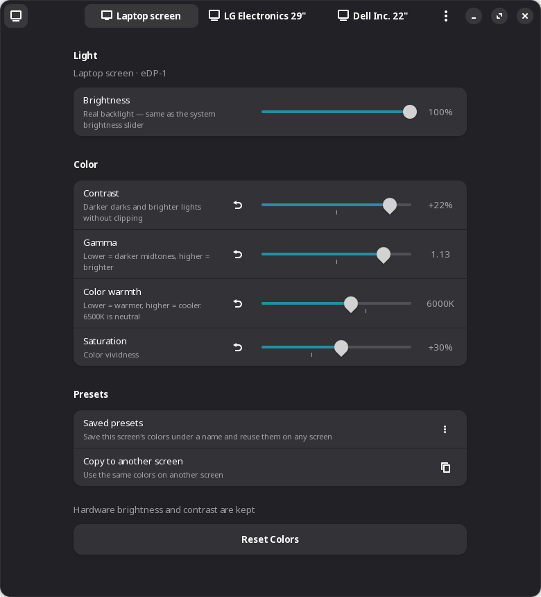
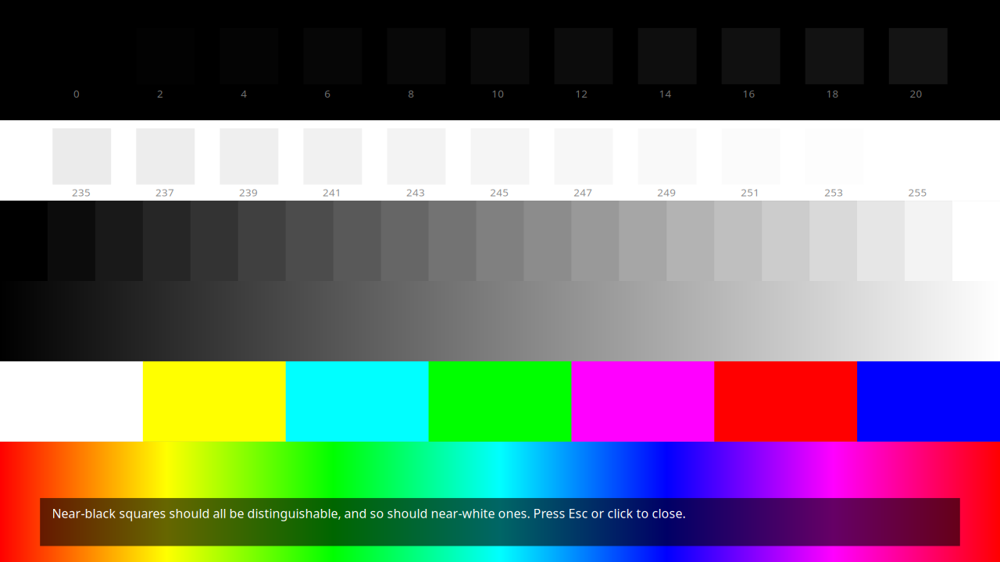

<p align="center">
  
</p>

<h1 align="center">Display Tune</h1>

<p align="center">
  Brightness, contrast, gamma, color warmth and saturation for <b>every display</b> on GNOME Wayland,<br>
  with a native GTK 4 / libadwaita interface in English and Arabic.
</p>

<p align="center"><a href="README.ar.md">العربية</a></p>

<p align="center">
  
  
</p>

## Why

GNOME has no built-in way to make a dull laptop panel look more vivid, dim an external monitor, or give each screen its own contrast. Wayland also blocks the old X11 tools (`xgamma`, `xcalib`, `redshift`), and the existing alternatives each cover only one piece. Display Tune puts all of it in one place, per display, and brings your settings back automatically.

## Features

- **Per-display pages** for the laptop panel and every external monitor
- **Brightness**
  - laptop backlight, kept in sync with GNOME's own slider
  - external monitors through DDC/CI (the real hardware brightness)
  - software dimming when a monitor can't be controlled
- **Hardware contrast** for monitors that support DDC/CI
- **Contrast, gamma and color warmth**, applied in the GPU gamma table: no flicker, no GPU cost, works in fullscreen games and video
- **Saturation per display**, through a bundled GNOME Shell extension that also works with several monitors (see [below](#the-multi-monitor-flicker-fix))
- **Saved presets** ("Movies", "Reading"…) that apply to any display
- **Copy settings** from one display to another or to all of them
- **Export / import** all settings to a JSON file
- **Automatic restore** at login and whenever a monitor is plugged in
- **One-click compare**: a header-bar toggle temporarily reverts every display to its
  original colors, so you can judge whether your tuning actually helps
- **Quick Settings integration**: a toggle next to Wi-Fi and Bluetooth turns color
  adjustments on/off, applies a preset, and adjusts every display's brightness — without
  opening the app
- **Test pattern** for judging black level, white level, gamma and color balance
- **Command line** for scripts and keyboard shortcuts
- **English and Arabic** (right-to-left) interface; the language follows the system and can be switched from the menu

<p align="center">
  
  
</p>
<p align="center">
  
</p>

## How it works

| Control | Mechanism |
|---|---|
| Laptop brightness | mutter's `DisplayConfig.SetBacklight` D-Bus API |
| Monitor brightness / contrast | DDC/CI with `ddcutil` (VCP `0x10` / `0x12`) |
| Contrast, gamma, warmth, software brightness | An ICC profile with a `vcgt` table is generated from mutter's EDID profile and made the display's default in **colord**. mutter loads it into the kernel `GAMMA_LUT`. |
| Saturation | A GLSL shader on GNOME Shell's UI group; the extension receives per-monitor factors from the app |
| Quick Settings toggle | A second, minimal extension that shells out to the `display-tune` CLI (`--list-json`, `--enable`/`--disable`, `--preset`, `--set-brightness`) and watches `settings.json` for changes made elsewhere |

Settings live in `~/.config/display-tune/settings.json`, keyed by each monitor's vendor, product and serial number, so they follow the monitor to whichever port it's plugged into. A small user service (`display-tune.service`) re-applies them at login and on hotplug.

The Quick Settings extension deliberately has no logic of its own for colord, ICC or ddcutil: it always goes through the CLI, so there is exactly one implementation of every setting to test and maintain, in Python.

## Requirements

- GNOME on **Wayland** (developed and tested on GNOME 50, Fedora 44)
- Python 3 with PyGObject, GTK ≥ 4.10, libadwaita ≥ 1.6
- colord (installed with GNOME on most distributions)
- Optional: `ddcutil` for hardware brightness/contrast of external monitors

```sh
# Fedora
sudo dnf install python3-gobject gtk4 libadwaita colord ddcutil
# Debian / Ubuntu
sudo apt install python3-gi gir1.2-gtk-4.0 gir1.2-adw-1 colord ddcutil libglib2.0-bin
# Arch
sudo pacman -S python-gobject gtk4 libadwaita colord ddcutil
```

`ddcutil` needs read/write access to `/dev/i2c-*`. Fedora's package grants it to the logged-in user. On other distributions you may need to add yourself to the `i2c` group; see the [ddcutil documentation](https://www.ddcutil.com/i2c_permissions/).

## Install

```sh
git clone https://github.com/Ahmad-Alqattu/display-tune.git
cd display-tune
./install.sh
```

Everything is installed for your user only (`~/.local`); no root is needed. **Log out and back in once** so GNOME Shell discovers the saturation extension. Everything else works immediately.

To update, `git pull` and run `./install.sh` again. To remove: `./install.sh --uninstall`.

## Command line

```sh
display-tune                                   # open the app
display-tune --list                            # displays, their settings, saved presets
display-tune --preset Movies                   # apply a preset to all active displays
display-tune --preset Reading --monitor eDP-1  # …or to one display
display-tune --reset --monitor DP-2            # back to defaults
display-tune --enable / --disable              # toggle color adjustments (compare with the original)
display-tune --set-brightness 60 --monitor DP-2  # set brightness through whatever channel that display has
display-tune --apply                           # re-apply saved settings
display-tune --list-json                       # machine-readable form of --list, for scripts
```

A preset command works well as a GNOME keyboard shortcut (Settings → Keyboard → Custom Shortcuts).

## The multi-monitor flicker fix

Saturation can't be done with a gamma table: those are per channel, and saturation mixes channels. The kernel's color matrix (`CTM`) would be ideal, but mutter doesn't implement `SetOutputCTM` for the native backend. So a shader is used, based on [zb3's Saturation Extension](https://github.com/zb3/gnome-saturation-extension).

With more than one monitor, that approach made the screen "dance" when switching windows. The cause is in Clutter: `ClutterOffscreenEffect` reuses its cached framebuffer unless the actor is flagged dirty, and the dirty flag is cleared after the **first** stage view paints. The next monitor's view then draws a buffer that only contains the first view's region. The bundled extension overrides `vfunc_paint` and always passes `CLUTTER_EFFECT_PAINT_ACTOR_DIRTY`, so every view renders its own region. This was verified in a headless GNOME Shell with two virtual monitors running at different refresh rates.

## Limitations

- **Saturation costs some GPU time.** It also disables fullscreen unredirection while it is active (any display with saturation ≠ 0).
- **Not every monitor accepts DDC/CI.** Some docks and MST hubs don't pass it through. Those monitors get software dimming instead.
- **Software brightness can only dim.** It can't go above the monitor's own maximum.
- **Other color tools may conflict.** The gamma table replaces any color profile you assigned in GNOME Settings for that display. Night Light keeps working on top.
- **X11 sessions are not supported.**

## Contributing

Issues and pull requests are welcome, especially testing on other GNOME versions and distributions. To add a translation, copy the `en` block in [`display_tune/i18n.py`](display_tune/i18n.py) and add your language to `LANGUAGES`.

## Credits and license

- **Saturation shader:** based on [gnome-saturation-extension](https://github.com/zb3/gnome-saturation-extension) by zb3 (GPL-2.0).
- **License:** Display Tune is released under the GNU General Public License v2.0 or later. See [LICENSE](LICENSE).
